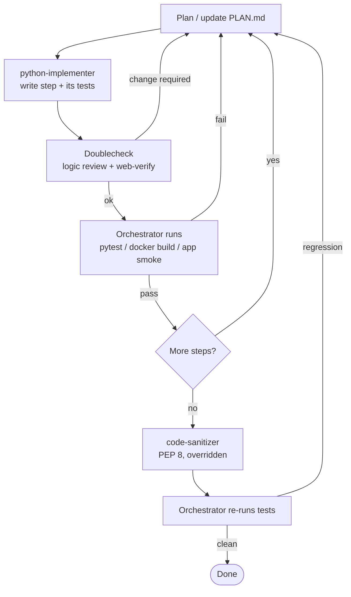

# Development workflow (agent orchestration)

The project is built by a fixed cycle of specialized agents. The **main session
acts as the single orchestrator** (the `ai-team-orchestration` "Producer" role):
it plans, delegates, verifies, runs tests/Docker, and integrates — but does not
hand-write feature code. Execution is **autonomous**: the orchestrator runs the
cycle end to end and only stops when a step fails (looping back to fix it) or
when the project is complete.

> **Why the main session orchestrates:** in this environment a subagent cannot
> reliably spawn or conduct other subagents — the main session is what launches
> each agent and receives its result. So "one agent managing all the others" is
> realized by the main session playing the orchestrator/Producer role.

## Roles

| Agent | Role | Tools | Notes |
|---|---|---|---|
| **Orchestrator** (main session) | Plan, delegate, run tests + Docker, integrate, loop on failures | all | Never writes feature code |
| **python-implementer** | Write the Python (and tests) for the planned step | Read/Edit/Write/Bash | ⚠ Base prompt is hardcoded for the PyQt5 "Lobito" project — **must be overridden** (see briefing) |
| **Doublecheck** | Verify correctness: adversarial logic review + web-verify external assumptions | web_search/web_fetch | **Cannot execute code** |
| **code-sanitizer** | Final polish: imports, PEP 8, docstrings | all | ⚠ Enforces camelCase args + PascalCase filenames by default — **must be overridden** |

## The cycle (autonomous)

## Rules

1. **Plan first.** Every change — a new step or a fix Doublecheck/tests demand —
   starts at the Planner (the orchestrator updates `PLAN.md`).
2. **Implement via python-implementer**, always with the override briefing below.
   It touches only the files the step names and writes that step's tests.
3. **Always Doublecheck** immediately after every implementer run.
4. **The orchestrator executes** (Doublecheck can't): after each code step it runs
   `uv run pytest -q`, and for the Docker/app steps it builds the image and
   smoke-launches the app. A failing test or a required Doublecheck change loops
   back to planning.
5. **Autonomous.** No pausing between green steps; stop only to fix a failure or
   when the whole project is complete.
6. **Sanitize last**, then re-run the tests to confirm no regressions.

## Agent briefings (overrides)

### python-implementer briefing — prepend to every call
- This is the **my-maps-to-google-maps Streamlit app**, **NOT** the Lobito Video
  Player. Ignore all PyQt5 / MVC / signals-slots conventions from your base prompt.
- Python 3.12+, dependencies via **uv**. Standard **PEP 8**: snake_case
  everywhere **including function arguments**; lowercase module filenames
  (`converter.py`, `app.py`). Type hints expected; `X | None` is fine.
- Run tests with **`uv run pytest -q`** from the project root — do **NOT**
  `cd lobito-player`.
- Edit only the files named in the step; also write that step's tests.

### code-sanitizer briefing
- Standard **PEP 8**. Do **NOT** convert arguments to camelCase. Do **NOT**
  rename modules to PascalCase. Use the project-local pylint config + the
  project's `template.mustache`.
- Run isort + autopep8 + docstring-filler; run pylint with the project config.
  **Zero logic changes.** After it finishes, the orchestrator re-runs the tests
  and confirms no argument/file renames slipped in.

### Doublecheck briefing
- Web-verify the external assumptions this app depends on:
  - Google Maps `dir` URL format (`?api=1&origin=…&destination=…&waypoints=…|…&travelmode=…`) and the ~10-stop cap.
  - My Maps KML export URL (`/maps/d/kml?mid=…&forcekml=1`).
  - Streamlit `AppTest` API (`streamlit.testing.v1.AppTest`).
  - The uv-in-Docker pattern and Streamlit server flags (`--server.address=0.0.0.0`).
- Adversarially review the chunking / overlap / order logic.
- Report required changes by severity.

## Notes
- The ordered build steps live in `PLAN.md` ("Build sequence").
